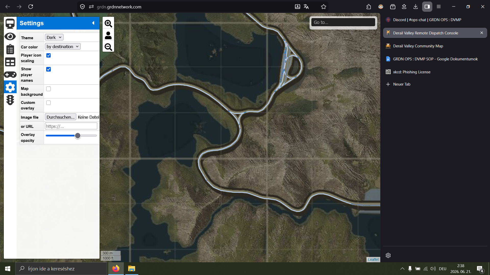
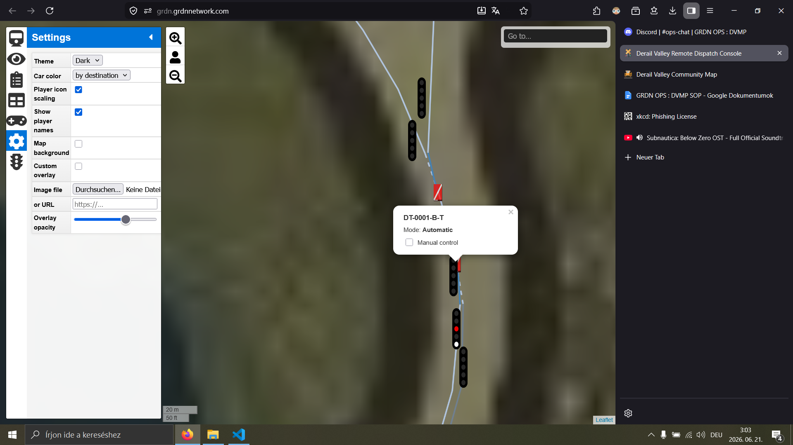
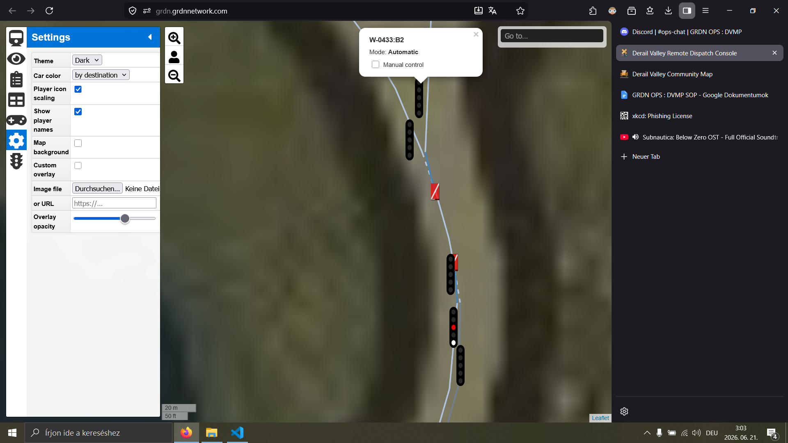
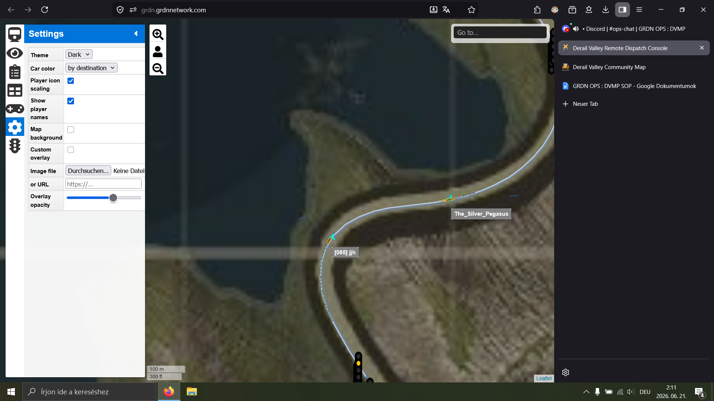

# 2026-07-01A

The incident involves 041 heading from Coal Mine South to City South, 045 heading from City South to Forest South and Dispatch at the end of a 3 hour session. Dispatch wasn't qualified at the time of the incident. They were originally supervised by a qualified dispatcher, although by the end of the session, the supervisor went to sleep.

During the session due to desyncs of switch states between players and the server, many signals showed red despite the route being correctly set with no train in the next block. 041 experienced at least one order to pass a signal showing red themselves and observed many others. Dispatch elected to issue orders to pass signals at danger even after receiving the ability to manually set signals halfway through the session and despite being directly shown by the supervisor that manually overriding the signal aspect also solves the issue. Clearances were generally manually specified (unless a train was following another) as well as protected by red signals. By the end of the session these orders to pass red were issued laxly: drivers would inform Dispatch that they are nearing a red signal before their stated clearance, Dispatch would look at their location and the switches ahead of them and tell simply tell them it's fine without specifying the exact red signal to be passed.

Dispatch wanted 041 and 045 to cross on the double track section south of the triangle between Coal Mine South and City South (see image 1). The switch for 041 was set incorrectly, routing both trains onto the cliffside track. Departing Coal Mine South, 041 was told that they may go full speed. 045 was the first to start entering the double track section and so received a yellow signal as the exit signal was manually set to stop. In the relevant triangle, 041 remarked that they observed a yellow signal. Based on the location of 041, Dispatch assumed this was referring to DT-0001-B-T protecting the double track section (see image 2). This in reality referred to W-0433:B2, the exit signal of the triangle (see image 3). Since 045 was clearing the switch at the southern end of the double track section entering the double track section, Dispatch told 041 that 045 is going to clear the switch (not specifying which switch) and so 041 can go full speed ahead. This was meant to inform 041 that they shouldn't expect a red signal at the exit of the double track; however, it was interpreted by 041 to mean a permission to pass red signal DT-0001-B-T protecting the double track section. 041 repeated the instruction to go full speed and entered the double track section on the same track occupied by 045 without slowing down. 045 asked 041 to confirm he's on the “inside”. 041 responded that he's on the cliffside track. An emergency stop order was issued by Dispatch. The two trains came to a stop about 300 m apart (see image 4) at around 2026 July 1 1:11 UTC.

Image 1:

Image 2:

Image 3:

Image 4:

