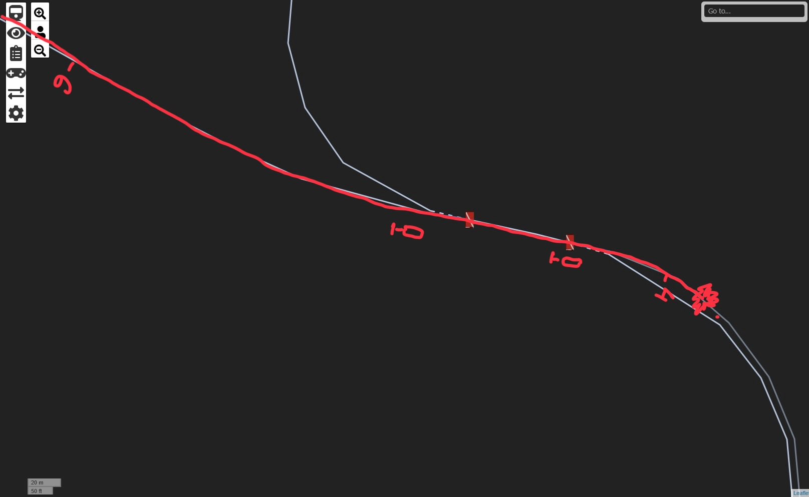
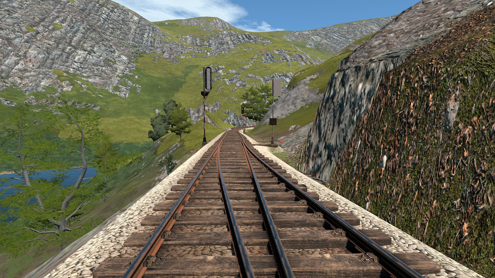
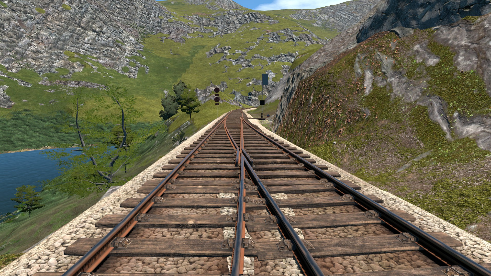
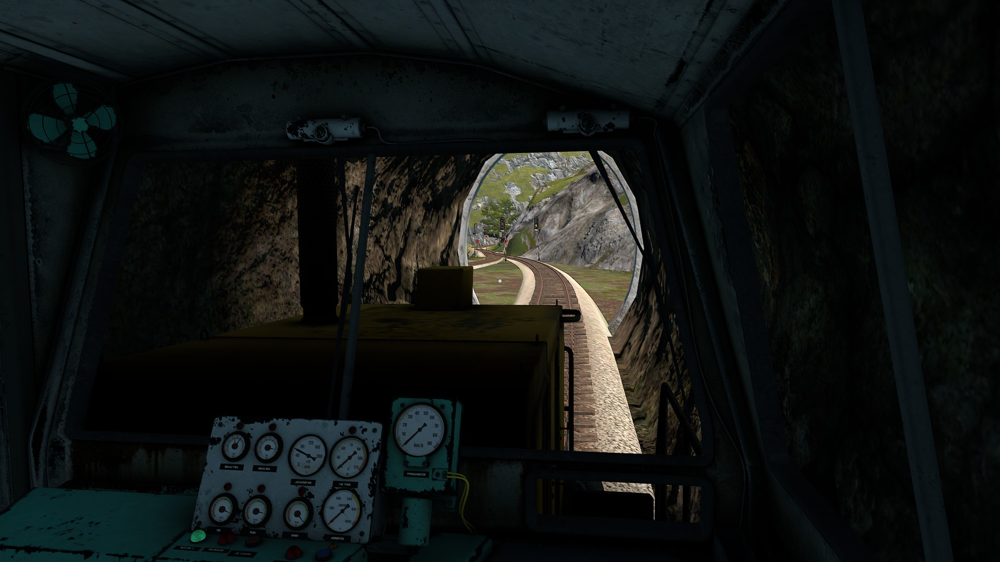
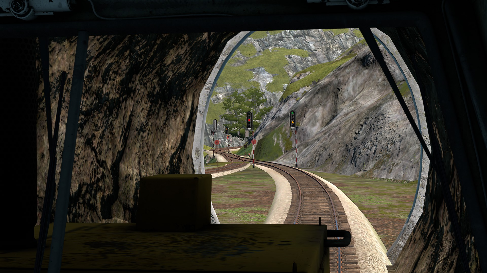
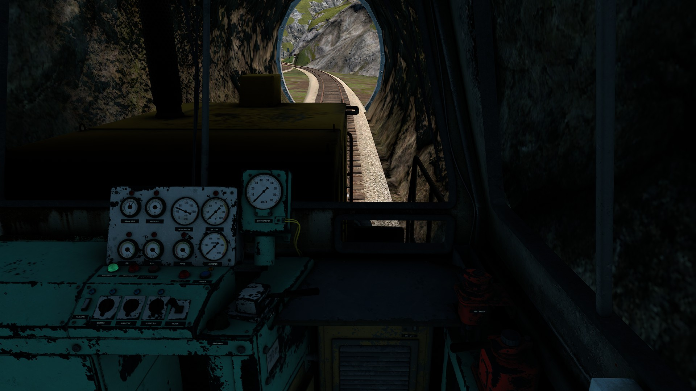

# 2026-07-09A

Mods active relevant to the incident:

- Double Track 1.4.3
- DV Signals 1.1.3-mp

On 2026-07-09 UTC during an unofficial session, 073 was driving from Food Factory to Harbor via Steel Mill. 073 consisted of a DE2 locomotive at the front, box cars in the middle and a helper DE2 locomotive at the back. The helper locomotive was operated by separate drivers. Since the helper locomotive was connected to the consist at speed, no attempt was made to connect in air, only the chain was connected. This meant 073 could not brake the helper locomotive, this was known to all relevant crew. A derailment occurred after the triangle halfway between Steel Mill and Harbor.

*The route taken by 073 until the derailment with speed signs and signals marked.*

The decrease in speed limit from 60 km/h to 40 km/h is not marked with a downwards pointing arrow.

According to the recollection of 073, they were driving just under 60 km/h. When spotting the 40 km/h speed sign, they attempted to brake, slowing to about 50 to 55 km/h by the time of the derailment. Due to reported mist, 073 tried to brake more cautiously to not lock up the wheels. 073 was chatting with others over radio about topics not strictly necessary before the incident.

In testing afterwards in the double track version, trains derail at that point when driving between 55 km/h and 60 km/h (usually tested closer to 60 km/h). A derailment below 55 km/h could not be reproduced. Without double tracks, trains complete the whole right turn without derailment going between 60 km/h and 65 km/h (usually tested closer to 60 km/h).

In the double track version, the 40 km/h speed limit sign is placed further back, although the earliest point the signs are visible (neglecting the resolution of the screen) is approximately the same for both.

*Double track version*

*Single track version*

Earliest point at which the signs are visible:

*Double track version*

*Single track version*

Some signals earlier showed a yellow bar despite the fact that the following junction had a speed limit higher than 40 km/h and wasn't set to a diverging direction. Hence, the yellow bars were ignored by 073.
