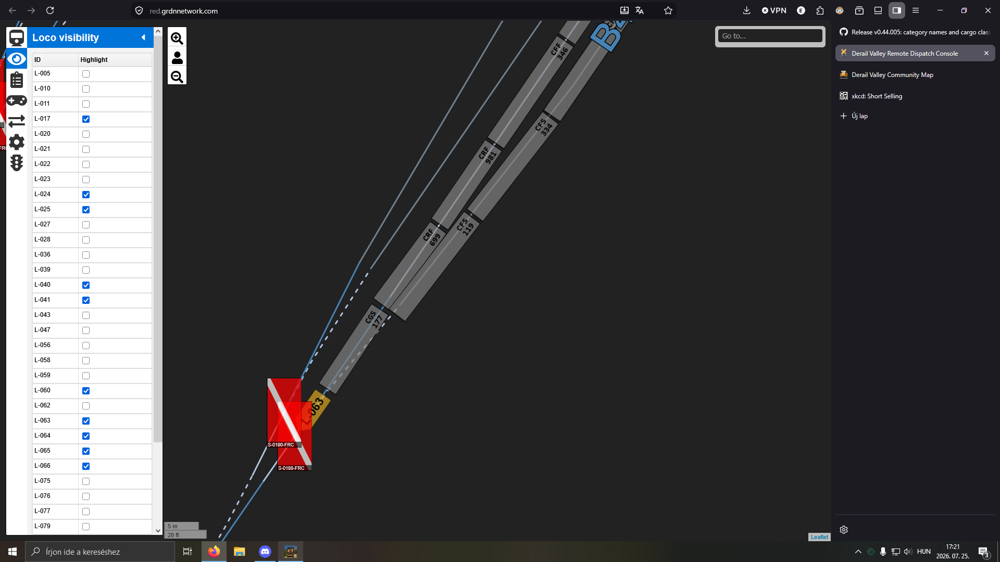

# 2026-07-25A

A couple of wagons were foul of a switch into which 063 collided as shown below. 063 did not receive a red signal. Dispatch did not notice the foul, may have only looked at switchboard view.

Statement from 063: i was at entrance of forest central on red aspect. i notified dispatch and they allowed me to continue per aspect, at which point i had a solid green - S2 - track clear.  i saw the cars and thought i had room to pass.  the loco and first car passed without issues, but the second car collided and derailed. after that i notified dispatch of the issue, and got permission to rerail the cars. the consist is now ready to continue